# Dự Án Quản Lý Tuyển Dụng

## Mô Tả
Dự án này cung cấp một nền tảng quản lý tuyển dụng, cho phép người dùng tìm kiếm việc làm và nhà tuyển dụng đăng bài viết tuyển dụng.

## 1. Thiết Kế Giao Diện Người Dùng

### 1.1. Giao Diện Đăng Ký
- Form đăng ký người dùng mới với các trường thông tin cơ bản như tên, email, mật khẩu.
    
### 1.2. Giao Diện Đăng Nhập
- Form đăng nhập cho người dùng với các trường email và mật khẩu.
    
### 1.3. Giao Diện Trang Chủ
- Hiển thị danh sách việc làm mới nhất và các mục tiêu nổi bật.
    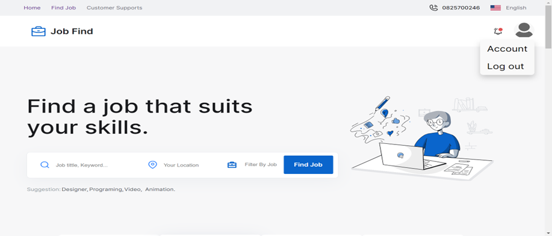
### 1.4. Tìm Kiếm Việc Làm
- Cho phép người dùng tìm kiếm việc làm theo thành phố hoặc loại công việc.
    
### 1.5. Thông Tin Chi Tiết Của 1 Việc Làm
- Trang hiển thị thông tin chi tiết về một việc làm cụ thể, bao gồm mô tả, yêu cầu, và thông tin liên hệ.
    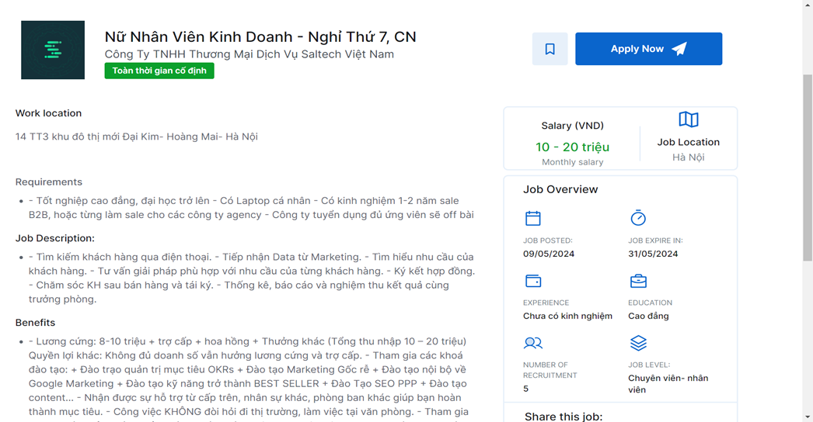
### 1.6. Apply Công Việc
- Cho phép người dùng nộp đơn xin việc trực tiếp thông qua hệ thống.
    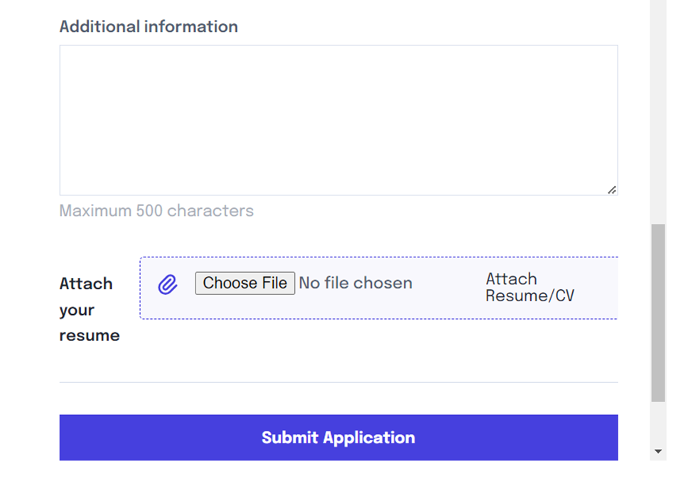
### 1.7. Gmail Được Gửi Về
- Hệ thống sẽ gửi email xác nhận đến người dùng sau khi họ nộp đơn.

### 1.8. Xem Thông Tin Chi Tiết Tài Khoản Người Dùng
- Người dùng có thể xem và chỉnh sửa thông tin cá nhân của mình.
    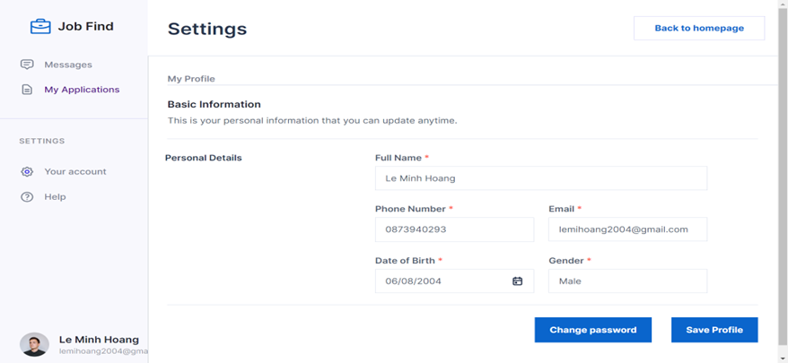
## 2. Giao Diện Nhà Tuyển Dụng

### 2.1. Giao Diện Đăng Nhập và Đăng Ký
- Form đăng nhập và đăng ký cho nhà tuyển dụng với các trường thông tin cần thiết.
    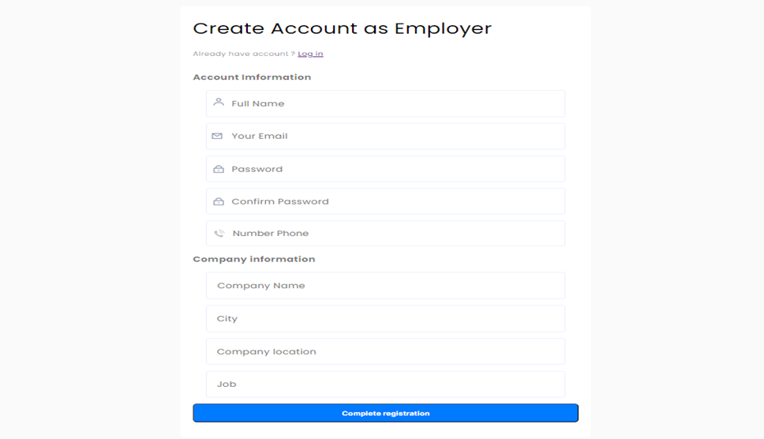
### 2.2. Trang Post Bài Viết
- Giao diện cho nhà tuyển dụng để đăng bài viết tuyển dụng mới, bao gồm mô tả công việc và yêu cầu.
    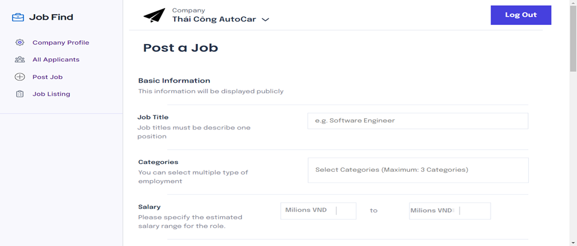
### 2.3. Trang Quản Lý Bài Viết
- Giao diện để nhà tuyển dụng quản lý các bài viết đã đăng, bao gồm chỉnh sửa và xóa bài viết.
    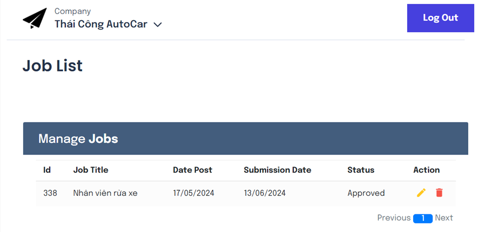
### 2.4. Duyệt CV và Gửi Email
- Chức năng cho phép nhà tuyển dụng duyệt CV ứng viên và gửi email phản hồi.
    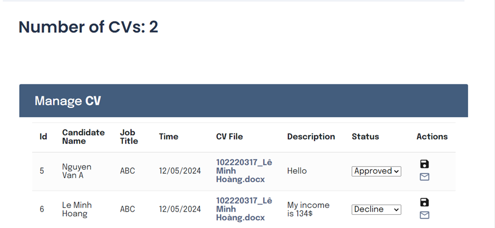
### 2.5. Thông Tin Cá Nhân Của Nhà Tuyển Dụng
- Giao diện cho nhà tuyển dụng xem và chỉnh sửa thông tin cá nhân của mình.
    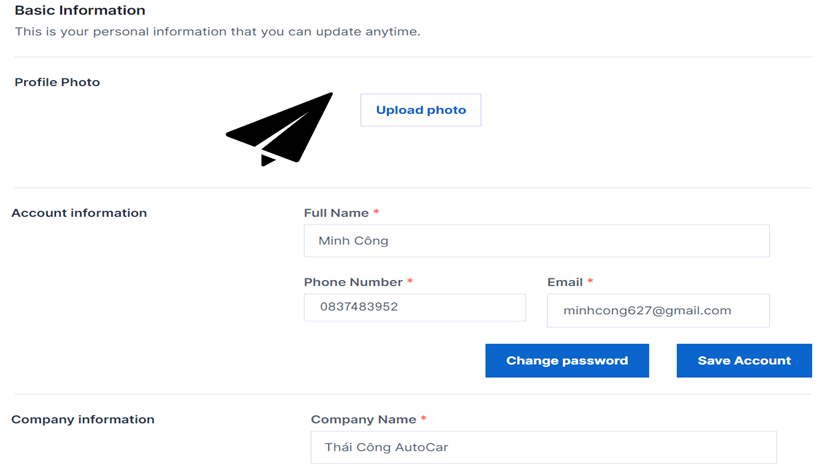
## 3. Giao Diện Admin

### 3.1. Giao Diện Trang Chủ Admin
- Trang chủ dành cho admin với thông tin tổng quan về hệ thống và hoạt động gần đây.
    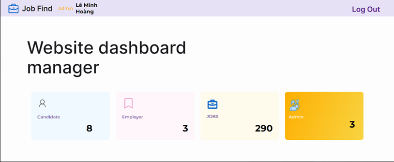
### 3.2. Duyệt Việc Làm Cho Nhà Tuyển Dụng
- Chức năng cho phép admin duyệt và phê duyệt các bài viết tuyển dụng từ nhà tuyển dụng.
    
### 3.3. Quản Lý Thông Tin Tài Khoản Admin
- Giao diện cho admin để quản lý và cập nhật thông tin tài khoản của mình.
    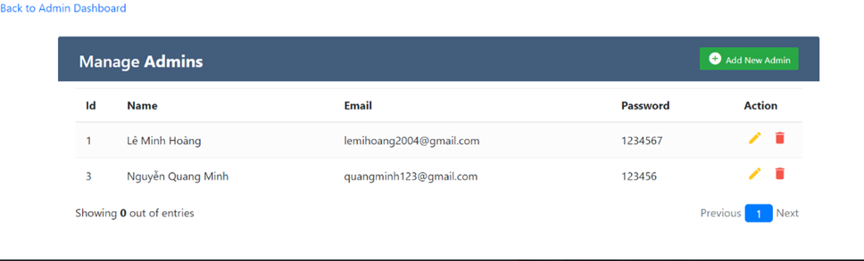
### 3.4. Quản Lý Thông Tin Người Dùng Website
- Chức năng cho phép admin quản lý thông tin người dùng, bao gồm xem, chỉnh sửa và xóa tài khoản người dùng.
    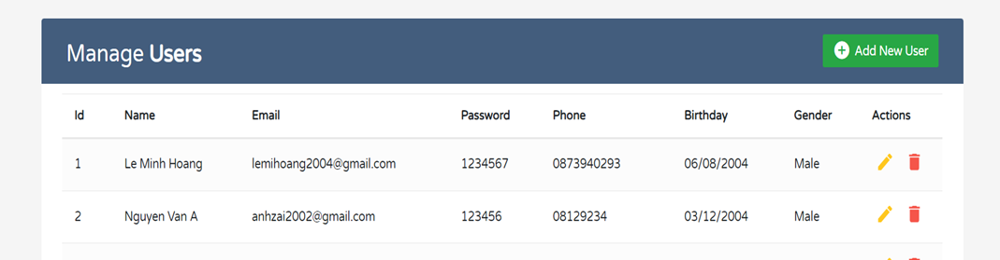